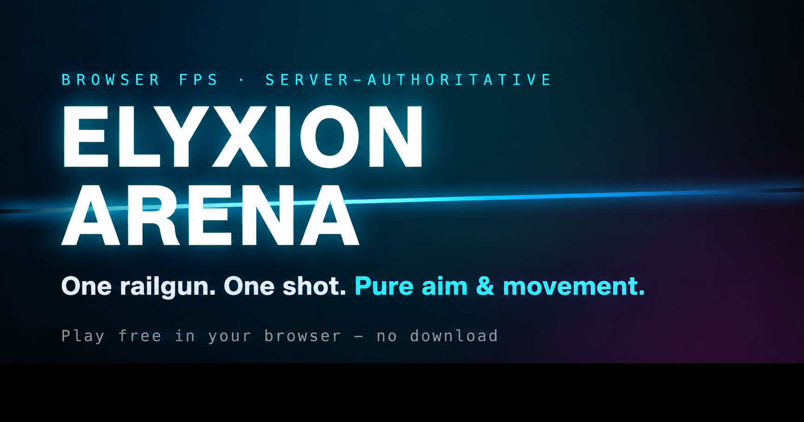

<div align="center">

# ⚡ Elyxion

**One railgun. One shot. One kill.**

A browser-based, server-authoritative, Quake-style instagib FPS.<br/>
No health bars, no loadouts — the whole game is **aim and movement**.

<strong>▶ &nbsp;PLAY NOW</strong><br/>
<sub>free · no download · no install · optional account</sub>

<br/>

[](LICENSE)
[](CONTRIBUTING.md)
[](tsconfig.json)

<br/>



<sub>Raw **Three.js** rendering · **64 Hz binary netcode** with lag compensation · one **Node** process (Express + `ws` + SQLite)</sub>

</div>

---

## Features

- **One-shot railgun.** No health, no armor, no other weapons. Pure duel of aim + movement.
- **Quake-style movement.** Strafe-jump acceleration, air control, directional dash, double-jump, wall-jump, and a damage-free boost-jump off surfaces.
- **Game modes** — Free-for-all, **Duel** (1v1, first to the frag limit), **Team Deathmatch** (Red vs Blue), **Last-Man-Standing**, and a **Ranked Duel** Elo ladder (login-only 1v1). Pre-match 3-2-1 countdown, mercy-rule blowout ends.
- **Server-authoritative multiplayer** with serious netcode (see [below](#the-netcode) — it's the most interesting engineering in the repo):
  - Lag compensation — the server rewinds every target to the shooter's render time before raycasting hitboxes. What you saw is what you hit.
  - 64 Hz binary snapshots, clock sync, fixed-delay interpolation of remotes, dead-reckoning through packet loss.
  - Anti-cheat: fire-rate gate, shot-origin sanity, horizontal **and vertical** speed clamps, message-rate flood guard, and a statistical **aimbot heuristic** (rolling hit/headshot-rate throttle).
  - **Reconnect / session resume** — a mid-match drop holds your slot + score for a grace window.
- **Rooms & lobby.** Quick-match (per mode), public custom lobbies, and private invite-code matches. End-of-match **map voting** + a **3D podium** of the top 3 (wearing their hats, playing their emotes).
- **Weekly challenge + replays.** A fixed weekly speedrun gauntlet with full-run **replay recording** — anyone can rewatch the leaderboard's runs in a first-person replay viewer.
- **Progression.** XP / levels / credits bound to an optional account (guest progress stays local), daily/weekly **challenges**, and a first-win-of-the-day bonus.
- **Cosmetics Locker.** Hats, kill-effects, rail-beam colors, "unusual" particles, emotes, killcam playercards, spawn effects, titles, crosshairs, and **announcer voice packs**. Level- or credit-gated, with an unboxing spinner and a live 3D preview. Purely visual — never an advantage. Ownership-checked server-side.
- **Offline play.** Bots with adjustable difficulty (human-like aim/movement, wearing cosmetics), solo FFA/TDM/Duel, and a training range — no server needed.
- **Juice + feedback.** Killcams, multi-kill medals, announcer (with optional captions), shockwave hit-markers, a red damage vignette, and a fully configurable crosshair.
- **Stats + leaderboards.** Per-browser K/D, accuracy, streaks, headshots (no login required) and a server-wide leaderboard with **All-time / Weekly / Daily** windows.
- **Onboarding & accessibility.** First-run name prompt + controls primer; reduced-effects toggle, announcer captions + a screen-reader live region, bright-enemy colorblind aid, full keybind remapping, and UI scaling.
- **Admin dashboard** (`/admin`) — KPIs, activity/retention timeseries, match + player drill-downs, and a moderated **player feedback / bug report** inbox (in-game "Send feedback" lands there, filterable by bug / feature request / general).

---

## The netcode

The hot path is engineered like a real arena shooter, not a tech demo. The
short version:

| Piece | How it works |
| --- | --- |
| **Tick rates** | Client sim, position upload, and server snapshots all run at **64 Hz**. Hits are event-driven and sub-tick. |
| **Binary wire** | The two hot messages are hand-packed binary ([`netcodec.ts`](src/game/netcodec.ts)): state rows quantize position to i16 (3.9 mm) → **~30–35 B/player/tick**; everything rare stays JSON. |
| **State/meta split** | Per-tick snapshots carry only numbers; identity + cosmetics ride a separate `meta` channel sent **only on change**. |
| **Anti-alias resample** | The server resamples every player's received positions to one consistent instant (per-sender adaptive lag, 20–180 ms) before snapshotting — and records **the same pose** into lag-comp history, so render == rewind *by construction*. |
| **Lag compensation** | Shots carry the shooter's `renderTime`; the server rewinds every hitbox to exactly what was on the shooter's screen (favor-the-shooter, clamped at 350 ms). |
| **Interpolation** | Remotes render at a **fixed** delay (110 ms @ 2p → 170 ms @ 8p, slewed on roster change — never derived from arrival timing, which wobbles under TCP). Dead-reckoning covers brief loss. |
| **Transport** | WebSocket with Nagle off + backpressure-aware sends, behind a **transport seam** that's ready for QUIC datagrams — a WebTransport channel is built and E2E-tested, gated on UDP ingress ([the plan](docs/NETCODE-UDP-PLAN.md)). |
| **Headroom** | The 64 Hz loop holds **1200 simulated clients** on one core ([`scripts/netcode-stress.ts`](scripts/netcode-stress.ts)); `loopLagMs` on `/api/live` is the always-on event-loop health gauge. |

Deep dives: [`docs/ARCHITECTURE.md`](docs/ARCHITECTURE.md) ·
[`docs/NETCODE-UDP-PLAN.md`](docs/NETCODE-UDP-PLAN.md) ·
[`docs/NETCODE-TCP-LOAD.md`](docs/NETCODE-TCP-LOAD.md)

---

## Tech stack

| Layer        | Choice                                                              |
| ------------ | ------------------------------------------------------------------ |
| Rendering    | [Three.js](https://threejs.org) (imperative, single `<canvas>`)    |
| Client app   | React 19 + React Router, bundled by [Vite](https://vitejs.dev)     |
| Styling      | Tailwind CSS v4                                                     |
| Game server  | Node.js + [`ws`](https://github.com/websockets/ws), run via `tsx`  |
| HTTP / API   | Express (static client + stats/auth/admin APIs)                     |
| Store        | SQLite via `better-sqlite3` (no ORM, no migrations)                |
| Language     | TypeScript end to end                                               |

No game engine, no networking library, no framework on the hot path — the
interesting parts are all in this repo.

---

## Quick start

**Prerequisites:** Node **≥ 20.19** (the build/toolchain needs it). With
[`fnm`](https://github.com/Schniz/fnm) or `nvm`, e.g. `fnm use 20.19.0`.

```bash
cd elyxion-arena
npm install
npm run cli -- dev
# or, after npm link, use the shorter `elyxion dev` command
```

The project includes a small Node-style CLI. `npm run cli -- <command>` works
without installing anything globally; `npm link` exposes the same executable as
`elyxion <command>`. The default `dev` command runs one Node process on
<http://localhost:8787>. It mounts Vite for client hot reload and also serves the
WebSocket game and APIs, so development and production use the same single origin.
Open <http://localhost:8787> and hit **Enter the arena**.

`npm run cli -- dev:server` is an alias for the same development server.

Useful CLI commands:

```bash
elyxion dev                         # single-port Vite + game server with live reload
elyxion serve                       # build and serve the production app
elyxion lan --server                # print the production LAN URL
elyxion load --players 8            # run the netcode load harness
elyxion run scripts/netcode-load.ts --players 2
elyxion --help
```

The `dev:server` script remains available as an alias for compatibility.

### Portable packages (no Node.js installation)

You can distribute the app as a self-contained folder for Linux, macOS, or
Windows. Each folder includes its own Node runtime and dependencies, so users
do not need to install Node.js or npm.

Build the package on the target platform after installing the project dependencies; the command also builds the client:

```bash
npm run package:portable
```

To choose a target explicitly:

```bash
npm run package:portable -- --target=linux-x64
npm run package:portable -- --target=macos-arm64
npm run package:portable -- --target=windows-x64
```

The package is written to `release/elyxion-arena-<target>/`. Distribute that
entire folder. On Windows run `elyxion.cmd start`; on macOS/Linux run
`./elyxion start`. The generated package also includes a `README.txt`.

For cross-platform builds, use the **Portable packages** GitHub Actions workflow
from the repository's Actions tab. It creates downloadable artifacts for Linux,
macOS, and Windows without requiring Node.js on the recipient's computer.

### Production


```bash
npm run build      # vite build -> dist/
npm start          # NODE_ENV=production tsx server/index.ts
# or both at once:
npm run serve
```

In production the **single Node server** (default port `8787`) serves the built
client from `dist/`, the APIs under `/api`, and the game socket at
`/ws/elyxion` — all on one port. Put any TLS terminator / reverse proxy /
CDN in front of it; the WebSocket rides the same origin. See
[`docs/DEPLOYMENT.md`](docs/DEPLOYMENT.md) for the Railway + Cloudflare setup
the live site runs on.

---

## Controls

| Input              | Action                              |
| ------------------ | ----------------------------------- |
| Mouse              | Aim                                 |
| Left click         | Fire railgun (one shot, one kill)   |
| `W` `A` `S` `D`    | Move                                |
| `Space`            | Jump (double-jump in the air)       |
| `Shift`            | Dash (directional, on a cooldown)   |
| Jump into a wall   | Wall-jump                           |
| `Esc`              | Release mouse / open the menu       |

All keybinds, mouse sensitivity (cm/360), FOV, crosshair, and volumes are
configurable in the in-game **Settings** menu and persist in `localStorage`.

---

## Game modes

Pick a mode in the menu before Quick Match or Create Match (quick-match only
pairs you with rooms of the same mode).

| Mode | Players | Win condition |
| ---- | ------- | ------------- |
| **Free-for-all** | up to 8 | First player to the frag limit ends the match → map vote. |
| **Duel (1v1)** | 2 | A single race to the frag limit — no rounds, no pauses. Leaving mid-match forfeits. A login-only **Ranked Duel** ladder uses the same format with Elo. |
| **Team Deathmatch** | up to 8 | Red vs Blue. Friendly fire is off; first team to the team frag limit wins. |
| **Last-Man-Standing** | up to 8 | Rounds; lose a life per death, last player alive takes the round. |

Mode tunables (frag/round limits, team sizes, colors) live in
`src/game/constants.ts` and are shared verbatim by the client and the
authoritative server.

---

## Configuration

Copy `.env.example` to `.env` (or set the vars in your process manager). All are
optional:

| Variable        | Default            | Purpose                                                        |
| --------------- | ------------------ | -------------------------------------------------------------- |
| `PORT`          | `8787`             | Port the Node server listens on.                               |
| `HOST`          | `0.0.0.0` (prod)   | Bind address.                                                  |
| `DATA_DIR`      | `./data`           | Directory for runtime data (the SQLite DB).                    |
| `DATABASE_PATH` | `./data/elyxion.sqlite` | Explicit DB file path (overrides `DATA_DIR`).           |
| `APP_BASE_URL`  | _(unset)_          | Production WebSocket origin allow-list. When set, only browsers loading the app from this origin may open the game socket. Unset = same-origin only. |
| `ADMIN_USERNAMES` | _(unset)_        | Comma-separated account names auto-promoted to admin.          |

---

## Project structure

```
elyxion-arena/
├─ index.html             # Vite entry (meta/OG/JSON-LD + crawlable noscript)
├─ vite.config.ts         # React + Tailwind plugins; mounted by the dev server
├─ src/
│  ├─ main.tsx            # React root + router (/ and /play)
│  ├─ pages/Landing.tsx   # marketing / controls splash
│  ├─ ElyxionClient.tsx  # the game client: canvas mount, HUD, menus, lobby
│  ├─ AdminDashboard.tsx  # /admin — metrics, players, feedback moderation
│  └─ game/               # the Three.js engine (framework-agnostic)
│     ├─ game.ts          #   main loop, match/HUD orchestration
│     ├─ player.ts        #   kinematic character controller
│     ├─ locomotion.ts    #   strafe-jump / air-accel / dash math
│     ├─ weapon.ts        #   railgun + hitscan
│     ├─ map.ts           #   arena geometry + collision
│     ├─ net.ts           #   client netcode: interpolation, clock sync, seam
│     ├─ netcodec.ts      #   binary wire codec (shared with the server)
│     ├─ bots.ts          #   offline bot AI
│     ├─ replay*.ts       #   weekly-challenge replay codec/recorder/viewer
│     ├─ cosmetics.ts     #   the locker: slots, unlock rules, catalog
│     └─ …                #   audio, effects, hats, input, training, podium
├─ server/
│  ├─ index.ts            # http + express static + /api + WS upgrade routing
│  ├─ elyxion-game.ts    # authoritative game server (modes, rooms, lag comp, anti-cheat)
│  ├─ db.ts               # better-sqlite3 store (stats, accounts, feedback, audit)
│  ├─ auth.ts             # optional username/password accounts (cookie session)
│  ├─ admin.ts            # admin metrics API + feedback moderation
│  ├─ feedback.ts         # in-game feedback/bug-report endpoint
│  ├─ stats.ts, leaderboard.ts, ranked.ts, challenge.ts
├─ scripts/               # netcode load/stress harnesses
├─ public/                # models, sounds, 16-9.png, robots.txt, sitemap.xml
└─ docs/                  # architecture + netcode + ops docs (see below)
```

The modules under `src/game/` that the server imports (`arena-data`,
`constants`, `types`, `netcodec`) are deliberately Three.js-free — the server
owns spawns, tunables, and the wire format without pulling in a renderer.

---

## Documentation

| Doc | What's inside |
| --- | --- |
| [`docs/ARCHITECTURE.md`](docs/ARCHITECTURE.md) | How the pieces fit: engine modules, netcode, lag compensation, anti-cheat boundary, wire protocol. |
| [`docs/NETCODE-UDP-PLAN.md`](docs/NETCODE-UDP-PLAN.md) | The TCP head-of-line ceiling and the WebTransport/QUIC migration (phases, status, host constraints). |
| [`docs/NETCODE-TCP-LOAD.md`](docs/NETCODE-TCP-LOAD.md) | Load-harness methodology + the baselines the netcode is held to. |
| [`docs/DEPLOYMENT.md`](docs/DEPLOYMENT.md) | Production setup: Railway origin + Cloudflare CDN in front. |
| [`docs/ADMIN-METRICS-API.md`](docs/ADMIN-METRICS-API.md) | Token-gated read-only metrics API for dashboards/monitoring. |
| [`docs/progression.md`](docs/progression.md) | XP / levels / credits / unlock design. |
| [`docs/ROADMAP.md`](docs/ROADMAP.md) | Where this is going. |
| [`docs/distribution-kit.md`](docs/distribution-kit.md) | Launch kit: portal listings, embeds, store copy. |
| [`docs/elyxion-arena-plan.md`](docs/elyxion-arena-plan.md) | The original design doc (some of it aspirational). |

---

## Stats & privacy

Accounts are **optional**: you play as a guest by default, and can register an
optional username/password account (no email required) to carry your XP, levels,
cosmetics, and rank across devices — progression is bound to the account
server-side. Casual/offline stats are reported by the client, so they're clamped
server-side but **best-effort and not anti-cheated**; ranked Duel Elo and
multiplayer match results, by contrast, are server-authoritative.

---

## Audio assets

Announcer voice lines and multi-kill medal callouts ship as `.ogg` files in
`public/sounds/elyxion/`. The railgun **fire / hit / kill** SFX have no bundled
clip and are **synthesized procedurally** via the Web Audio API at runtime. Drop
a matching `.ogg` at the path listed in `src/game/audio.ts` (`SOUND_URLS`) to
override any sound; missing announcer lines fall back to speech synthesis.

---

## npm scripts

| Script             | What it does                                              |
| ------------------ | -------------------------------------------------------- |
| `npm run dev`      | Single-port dev server with Vite hot reload.              |
| `npm run cli -- <command>` | Run the Node-style `elyxion` CLI without a global install. |
| `elyxion dev`     | Single-port dev server (after `npm link`).               |
| `npm run dev:server` | Alias for the single-port dev server.                   |
| `npm run build`    | Production client build to `dist/`.                      |
| `npm start`        | Run the production server (expects `dist/`).             |
| `npm run serve`    | `build` then `start`.                                    |
| `npm run typecheck`| Type-check client and server projects.                   |
| `npm run lint`     | ESLint.                                                  |
| `npm run netcode:load` | Netcode load harness against a local server.         |
| `npm run package:portable` | Build a self-contained no-Node package for the current platform. |

---

## Contributing

PRs and issues welcome — see [CONTRIBUTING.md](CONTRIBUTING.md). Contributions
require agreeing to the lightweight [Contributor License Agreement](CLA.md) via
the checkbox in the pull request template. Found a bug or have an idea? Use the
in-game **Send feedback** button (it lands in the admin panel).

## Security

Report vulnerabilities — and any way to cheat (forge stats, bypass server
validation) — privately. See [SECURITY.md](SECURITY.md).

## License

The **source code** is licensed under the **GNU AGPL-3.0** — see [`LICENSE`](LICENSE).
The AGPL is strong copyleft: if you run a modified version as a network service, you
must offer your users the corresponding source under the same terms.

**Game assets** (3D models, audio) are licensed separately — see [`NOTICE`](NOTICE).

**Commercial / dual licensing:** to use this code in a closed-source or commercial
product without the AGPL's obligations, a separate commercial license is available —
contact the maintainer.
